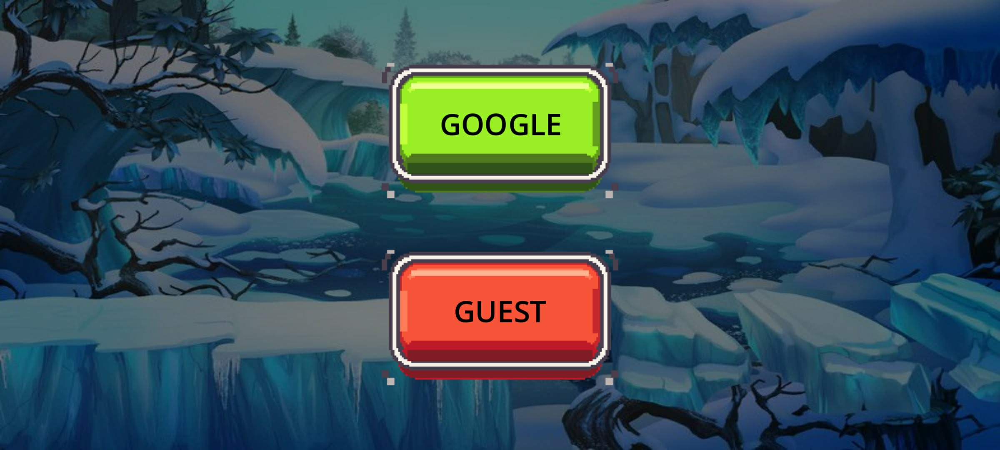
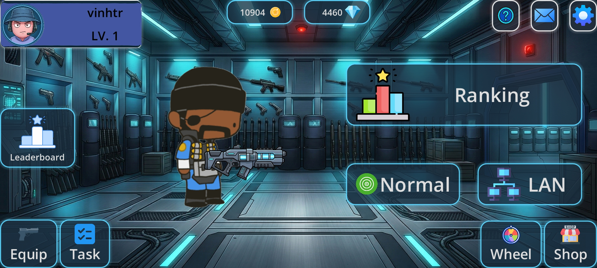
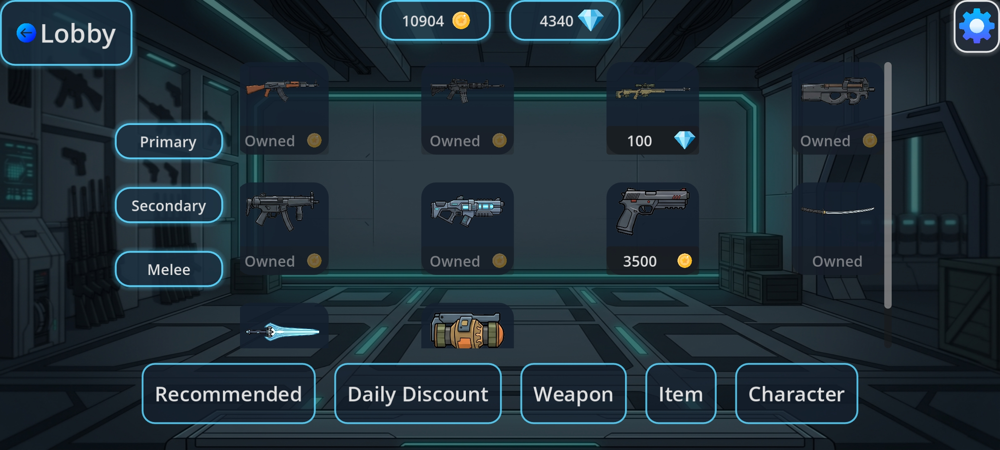
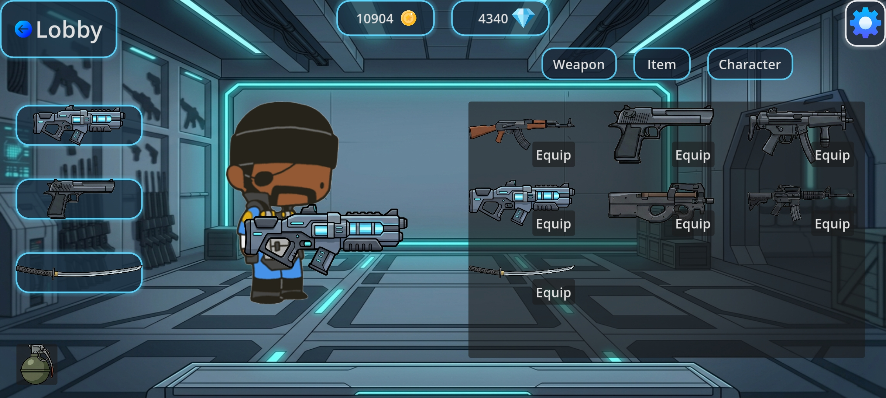
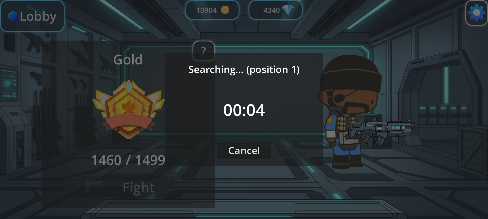
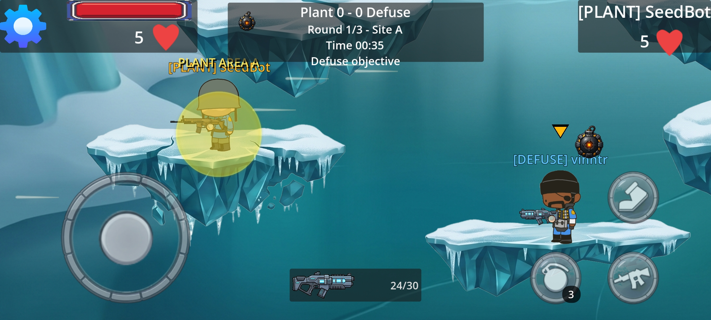
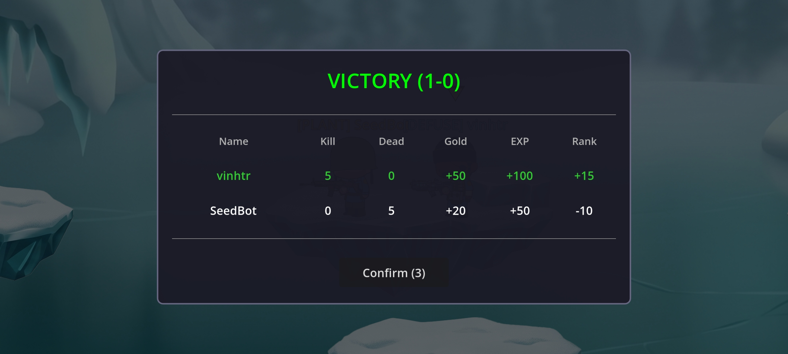

# Knockback

**Knockback** is a networked multiplayer 2D action game built with **Godot 4.6** (Mobile renderer). Players engage in fast-paced PvP combat driven by physics-based knockback mechanics — knock your opponent off the map to win. The game is backed by a REST API ([**game-platform-api**](https://github.com/vinhtruong204/game-platform-api)), Google Sign-In authentication, and full progression systems (shop, equipment, economy, ranks).

Target platforms: **Android** (primary) and **Windows** (dedicated server).

> **Backend:** the REST API this client talks to lives in **[game-platform-api](https://github.com/vinhtruong204/game-platform-api)** (four FastAPI microservices). See [Related Repositories](#related-repositories).

## Gameplay


Two players spawn on a shared map and battle using guns, bombs, and melee weapons. Every hit applies a knockback force — reduce your opponent's hearts to zero or knock them into the death zone to win the round.

### 🎬 Demo Video

Watch a full match on YouTube:

[](https://youtu.be/46rG1U83-H4)

> ▶️ [https://youtu.be/46rG1U83-H4](https://youtu.be/46rG1U83-H4)

## Screenshots

### Login


### Lobby


### Shop


### Equipment


### Matchmaking


### In-Game HUD


### Match Result


## Features

- **Real-time 2D PvP** — 2 players per match over ENet (UDP), server-authoritative.
- **Physics-based knockback** — bullets, bombs, and melee apply directional force vectors.
- **Config-driven balance** — character HP / speed and weapon damage / fire-rate / ammo come from the backend, not hardcoded.
- **Progression** — gold, EXP, rank points, shop, equipment, and inventory.
- **Authentication** — Google Sign-In on Android, dev login on desktop.
- **Multi-tier caching** — static/semi/dynamic API caches with disk persistence.

## Tech Stack

| Layer | Technology |
|-------|-----------|
| Engine | Godot 4.6 (Mobile renderer) |
| Language | GDScript |
| Networking | ENetMultiplayerPeer (UDP), server authority |
| Backend | REST API (4 microservices, ports 8000–8003) |
| Auth | Google Sign-In (Android) / dev login (desktop) |
| Display | 1080×486 viewport, `canvas_items` stretch, `expand` aspect |

## Running the Project

- **Editor:** Open in the Godot 4.6 editor and run with `F5`.
- **CLI:** `godot --path .`
- **Dedicated server:** `godot --path . --dedicated_server`
- **Android build:** `godot --export-release "Android" export/knockback.apk`
- **Windows server export:** `godot --export-release "Windows Desktop" export/knockback.exe`

There are no separate build, lint, or test commands — this is a Godot project managed through the editor and engine CLI.

## Architecture Overview

### Scene Flow

```
Main (main.tscn)
├── SceneContainer  ← SceneLoader swaps scenes here
├── GlobalUi        ← Persistent loading screen, notifications, confirmations
└── TransitionLayer ← Fade in/out animations between scenes

Flow: Login → Lobby → Game
```

### Autoload Singletons

| Singleton | Role |
|-----------|------|
| SceneLoader | Threaded scene loading with progress tracking |
| NetworkManager | ENet multiplayer peer setup (server/client) |
| ApiManager | Base HTTP client, session token, auth headers |
| PlayerApi | Auth, profiles, inventory, equipment, currency |
| ConfigApi | Weapons, characters, achievements, level/rank configs |
| EconomyApi | Shop items, currency |
| MatchApi | Matches, matchmaking, maps, modes |
| CacheManager | Multi-tier caching (static 1h / semi 5m / dynamic 30s) |
| AudioManager | Audio bus volume control (Music, SFX) |

### Backend API

The API is a separate project — **[game-platform-api](https://github.com/vinhtruong204/game-platform-api)** — comprising four independent FastAPI microservices, each with its own PostgreSQL database.

Base URL: `http://100.96.156.107`

| Port | Service | Endpoints |
|------|---------|-----------|
| 8000 | Player | `/auth/*`, `/players/*`, `/player-inventory/*`, `/player-equipment/*`, `/player-currency/*` |
| 8001 | Config | `/weapons`, `/characters`, `/achievements`, `/level-configs`, `/rank-configs` |
| 8002 | Economy | `/shops/*` |
| 8003 | Match | `/matches/*`, `/match-players/*`, `/matchmaking/*`, `/maps`, `/modes` |

Auth uses a Bearer token via the `Authorization` header; the session is stored at `user://auth.cfg`.

### Multiplayer

- **Protocol:** ENetMultiplayerPeer (UDP), game server at `100.96.156.107:9543`.
- **Authority model:** Server is authority — clients send RPC requests, the server validates and executes.
- **Max players:** 2 per match.

## Project Structure

```
knockback-godot/
├── assets/          # Audio, game, loading, lobby, login, and UI assets
├── addons/          # google_sign_in, virtual_joystick_plus
├── scenes/          # Scene files (.tscn)
├── scripts/         # GDScript source
│   ├── global_scripts/   # Autoloads, API network, models
│   └── main_container/   # Lobby and game logic
├── docs/images/     # README screenshots & gameplay gif
├── export/          # Build outputs
└── project.godot    # Godot project config
```

For a deeper breakdown of the player component system, spawners, match lifecycle, and config-driven stats, see [`CLAUDE.md`](CLAUDE.md).

## Related Repositories

| Repository | Role |
|------------|------|
| **knockback-godot** *(this repo)* | The **game client** — Godot 4.6 multiplayer 2D action game. |
| **[game-platform-api](https://github.com/vinhtruong204/game-platform-api)** | The **backend** — four FastAPI microservices (player / config / economy / match) on ports 8000–8003, each with its own PostgreSQL database. |

This client's API autoloads map to the backend services: `PlayerApi` → player-service (8000), `ConfigApi` → config-service (8001), `EconomyApi` → economy-service (8002), `MatchApi` → match-service (8003).
